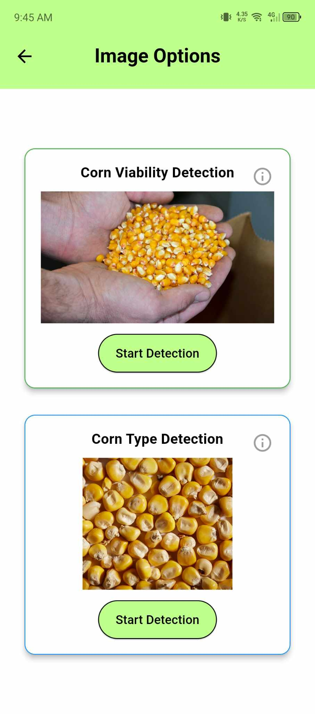
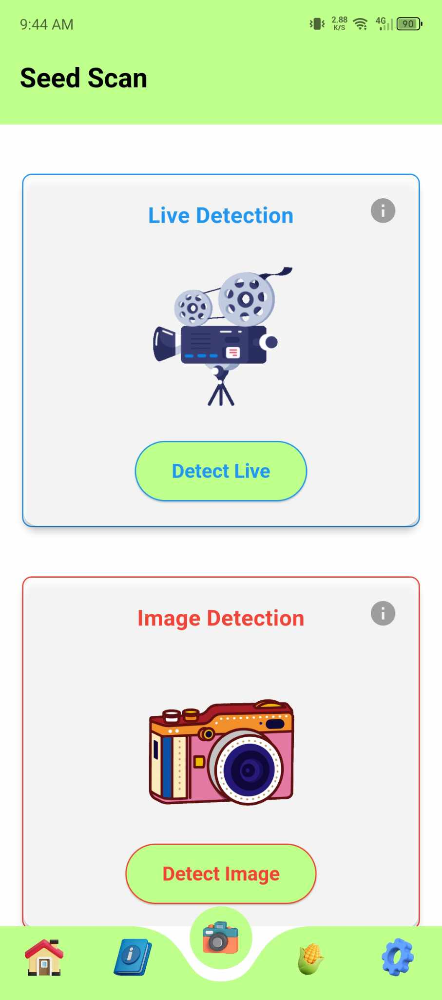

# Seedscan 

A Flutter application designed to provide a user-friendly interface for selecting and performing tasks like "Corn Viability Detection" and "Corn Type Detection." The app features an intuitive UI with interactive cards and information pop-ups for each task.

---

## Features

- **Corn Viability Detection**  
  Users can start the viability detection process for corn.

- **Corn Type Detection**  
  Allows users to determine the type of corn with ease.

  - **Harvest Estimation Features**  
  Allows users to determine the probable number of harvest base on the viability results.

  - **User Friendly**  
  Allows users to use the app with ease.

- **Information Pop-Ups**  
  Each detection option includes an info icon that provides additional details about the task.

---

## Screenshots

<p align="center">
  
</p>

<div style="display: flex; justify-content: center; gap: 20px;">
   
   
   
   
   
</div>

---

## Requirements

- **Flutter SDK**: Version 3.0.0 or later
- **Dart**: Version 2.17.0 or later
- Supported Platforms: Android, iOS

---


### Step 1: Install Flutter

1. **Download Flutter SDK**  
   Visit the [Flutter website](https://flutter.dev/docs/get-started/install) and follow the installation instructions for your operating system.

2. **Verify Installation**  
   Run the following command in your terminal to ensure Flutter is correctly installed:
   ```bash
   flutter doctor

## Installation of the Project Instructions

1. Go to Project Directory
   ```bash
   cd seedscan
2. Install packages and dependencies
   ```bash
   flutter pub get
3. Run the project
   ```bash
   flutter run