# Seedscan 

A Flutter application designed to provide a user-friendly interface for selecting and performing tasks like "Corn Viability Detection" and "Corn Type Detection." The app features an intuitive UI with interactive cards and information pop-ups for each task.

---

## Features

- **Corn Viability Detection**  
  Users can start the viability detection process for corn.

- **Corn Type Detection**  
  Allows users to determine the type of corn with ease.

- **Harvest Estimation Features**  
  Allows users to determine the probable number of harvest base on the viability results.

- **Data History**  
  Allows users to save detection reading.

- **Display Graphical Representations**  
  Can Display data visualization in each readings in a graphical representation.

- **User Friendly**  
  Allows users to use the app with ease.

- **Information Pop-Ups**  
  Each detection option includes an info icon that provides additional details about the task.

---

## Screenshots

<p align="center">
  
</p>

<div style="display: flex; justify-content: center; gap: 20px;">
   
   
   
   
   
   
   
   

</div>

## Datasets (With Augmentations)

<div style="display: flex; justify-content: center; gap: 20px;">
<li> Model 1: Corn Viability Model - 11,340 images used</li>
<li> Model 2: Corn Type Model - 8,856 images used</li>
</br>
## Preprocessing
<li>Auto-Orient: Applied</li>
<li>Static Crop: 20-60% Horizontal Region, 26-73% Vertical Region</li>
<li>Resize: Stretch to 255x255</li>
<li>Auto-Adjust Contrast: Using Contrast Stretching</li>
<li>Grayscale: Applied</li>
<li>Tile: 1 rows x 1 columns</li>
</br>
<h2>Augmentations includes: </h2>
<li>Flip: Horizontal, Vertical</li>
<li>90° Rotate: Clockwise, Counter-Clockwise, Upside Down</li>
<li>Crop: 5% Minimum Zoom, 14% Maximum Zoom</li>
<li>Rotation: Between -10° and +10°</li>
<li>Shear: ±11° Horizontal, ±13° Vertical</li>
<li>Hue: Between -21° and +21°</li>
<li>Saturation: Between -28% and +28%</li>
<li>Brightness: Between -20% and +20%</li>
<li>Exposure: Between -10% and +10%</li>
<li>Blur: Up to 1px</li>
   
   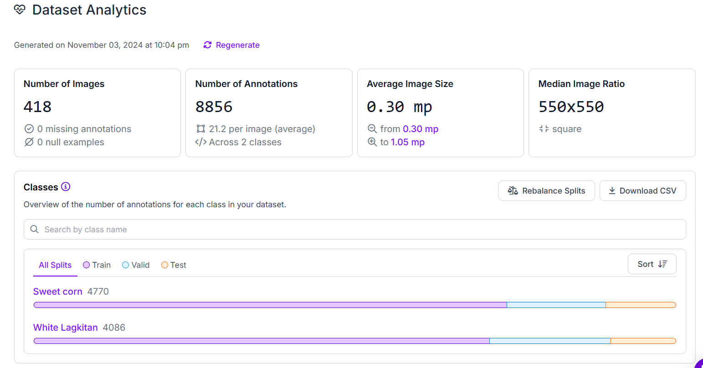
</div>

## Model Performance
   
   
   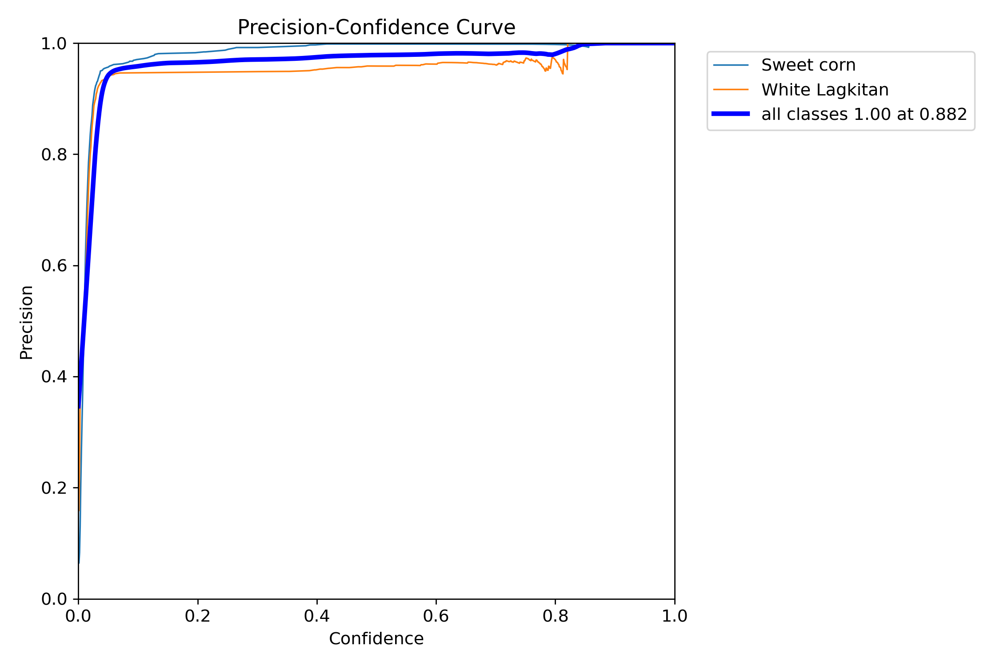
   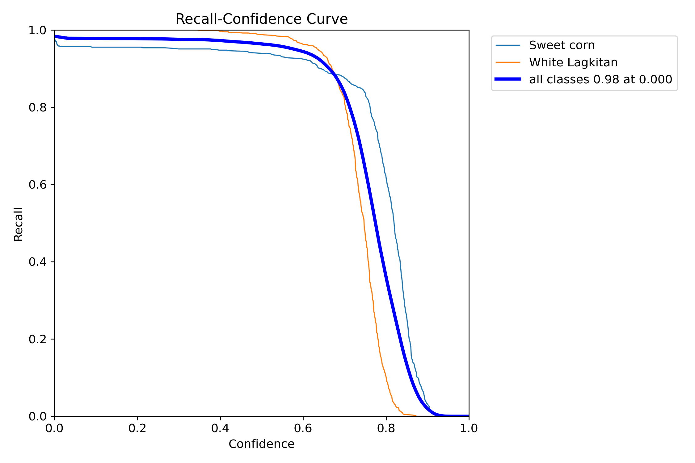
   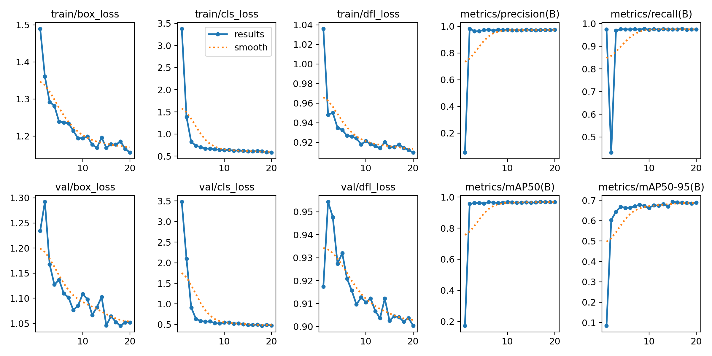

<div style="display: flex; justify-content: center; gap: 20px;">
   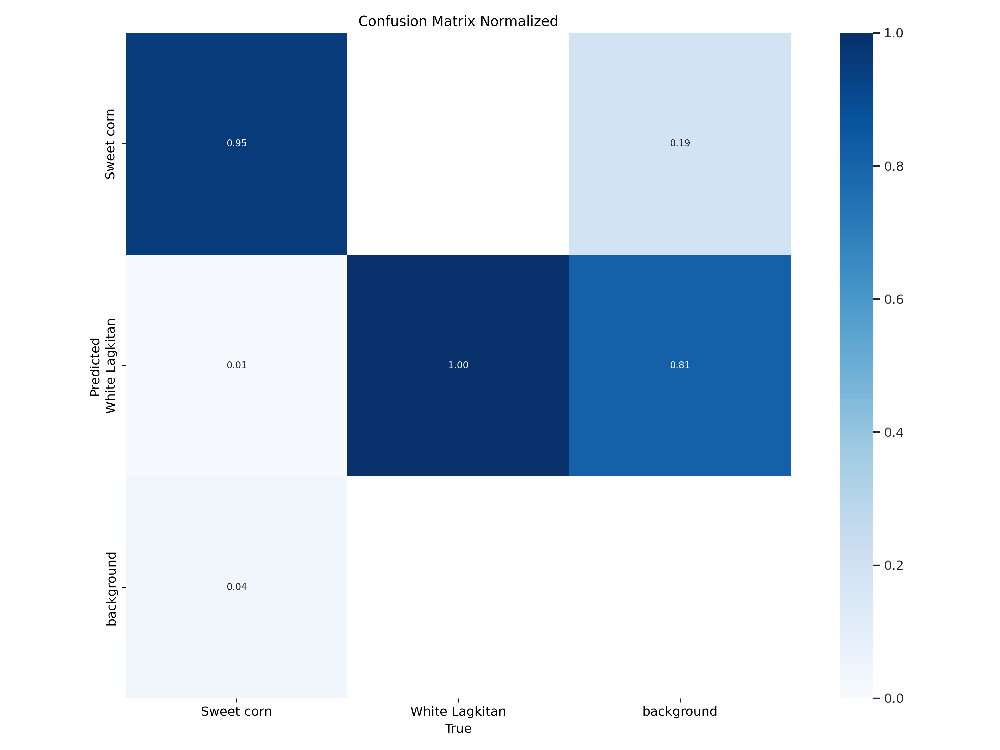
   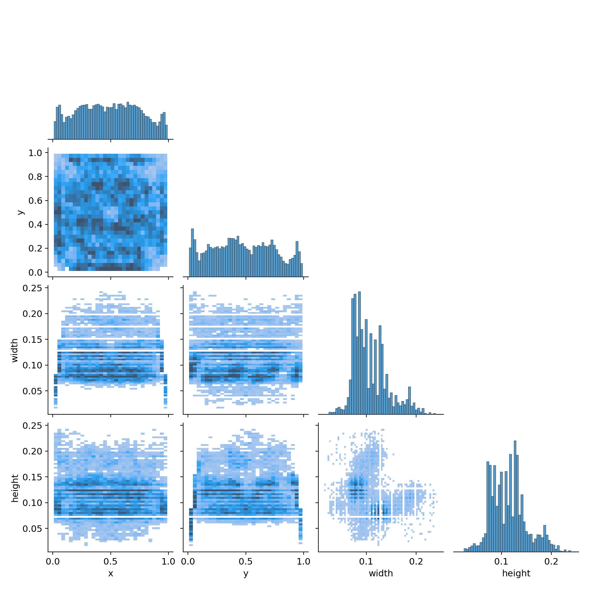
   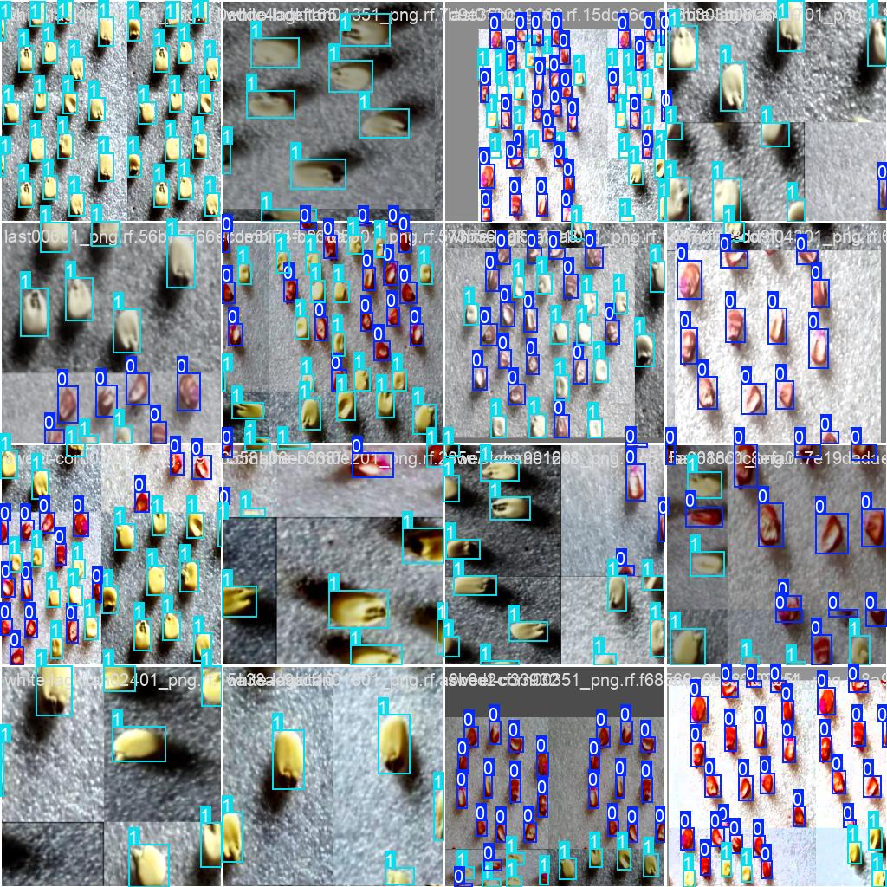
   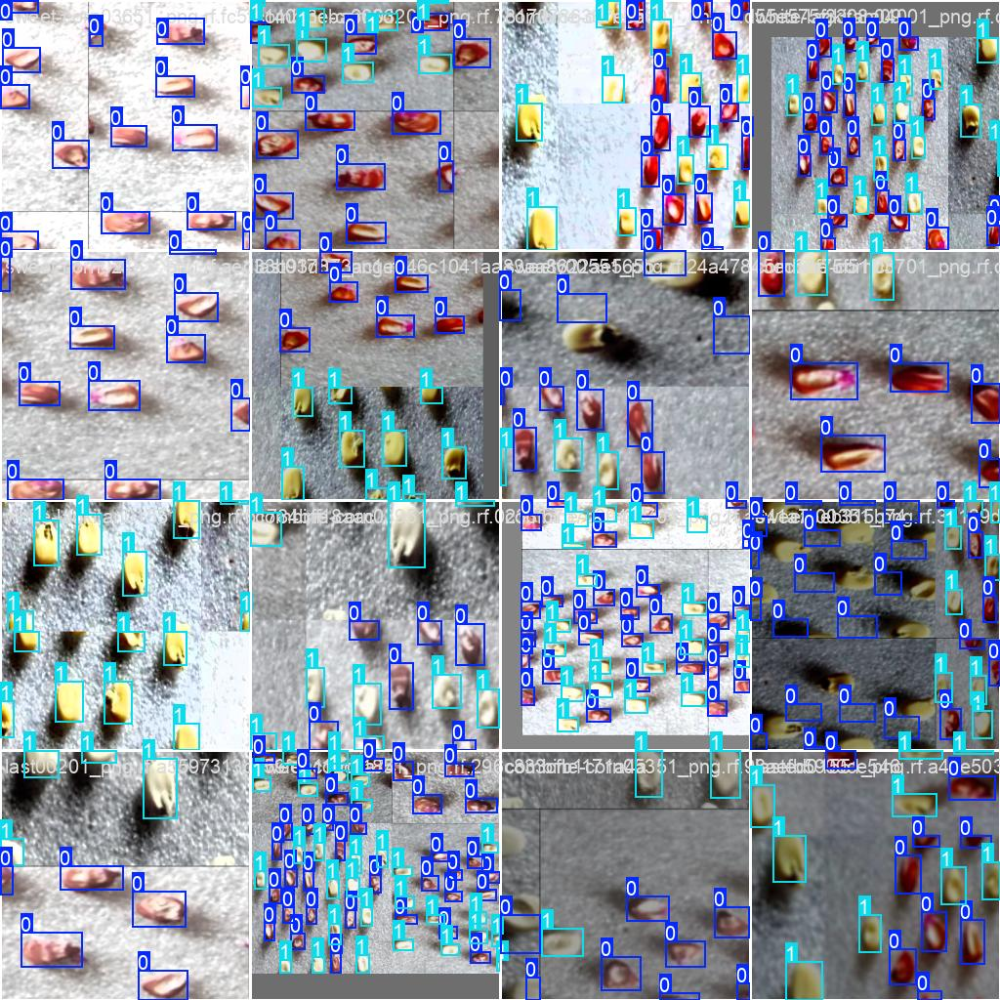
   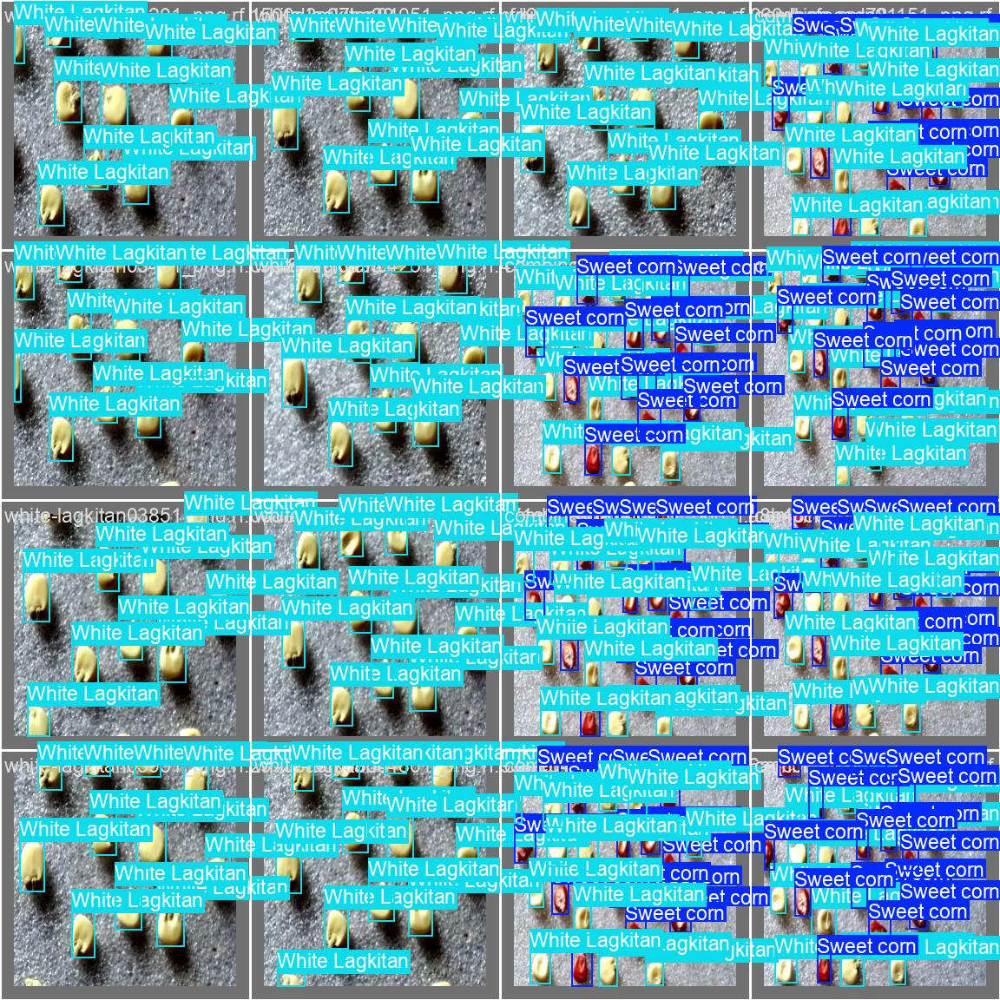
   
   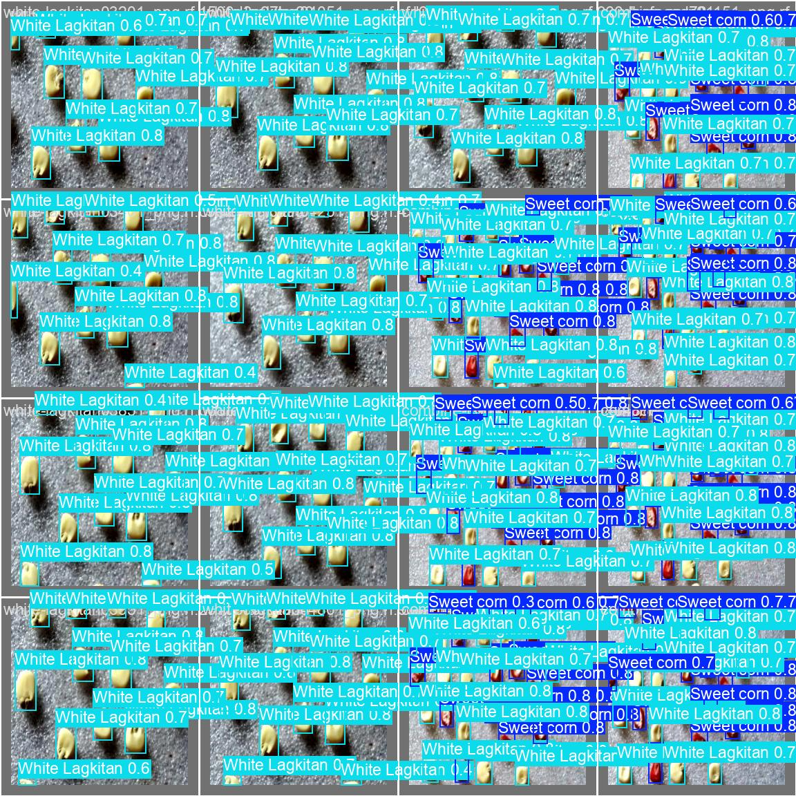
   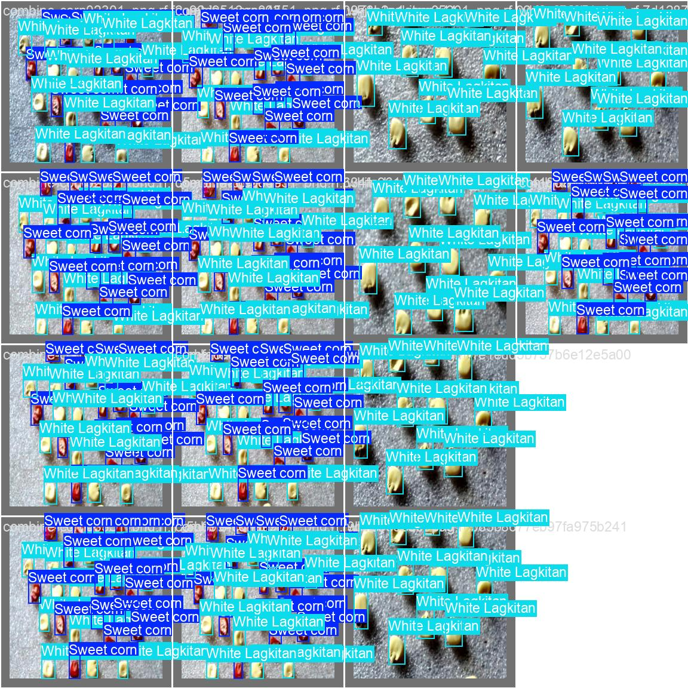
   

---
## Requirements

- [Flutter SDK: Version 3.22.3 or later](https://flutter.dev/docs/get-started/install)
- [Dart : Version 2.17.0 or later](https://dart.dev/get-dart)
- [Android Studio](https://developer.android.com/studio)
- [Visual Studio Code](https://code.visualstudio.com/)
- [Supported Platforms: Android, iOS, Linux, Windows, Macos and Web.](https://flutter.dev/multi-platform)

## Required Dependencies/Packages
- [curved_navigation_bar](https://pub.dev/packages/curved_navigation_bar)
- [sqflite 2.4.1 ](https://pub.dev/packages/sqflite)
- [flutter_launcher_icons 0.14.1 or later](https://pub.dev/packages/sqflite)
- [curved_navigation_bar 1.0.6 ](https://pub.dev/packages/curved_navigation_bar)
- [flutter_vision](https://pub.dev/packages/flutter_vision)
- [fl_chart](https://pub.dev/packages/fl_chart)
- [pie_chart](https://pub.dev/packages/pie_chart)
- [camera](https://pub.dev/packages/camera)
- [tflite 1.1.2](https://pub.dev/packages/tflite)
- [tflite_flutter](https://pub.dev/packages/tflite_flutter)
- [flutter_secure_storage 9.2.2](https://pub.dev/packages/flutter_secure_storage)
- [local_auth 2.3.0](https://pub.dev/packages/local_auth)

---

## How to Set up this Project?

### Step 1: Install Flutter

1. **Download Flutter SDK**  
   Visit the [Flutter Website](https://flutter.dev/docs/get-started/install) and follow the installation instructions for your operating system.

2. **Verify Installation**  
   Run the following command in your terminal to ensure Flutter is correctly installed:
   ```bash
   flutter doctor

### Step 2: Install Android Studio
1. Download [Android Studio Here](https://developer.android.com/studio) and follow the installation instructions for your operating system.

2. **Verify Installation** 

3. **Setup android studio**  

4. **Download Emulator** 

5. **Integrate Virtual Emulator path to your VS code / If you don't want virtual emulator, use physical device** 

- In your Physical Device Open Android build Version Click it 7 times.
- You are now a Developer.
- Navigate to Developer Options.
- Navigate and Allow USB Debugging.
- Connect your physical device to your computer using cable.

## Clone Repository / Project Repository
1. Be sure you have already install git.

2. Download [Git Here](https://git-scm.com/downloads) and follow the installation instructions for your operating system.

3. Install and setup git in your computer.

4. Open command prompt in your computer and type this command and press enter to clone my project repository.
   ```bash
   git clone 'https://github.com/lightdarkmaster/seedscan'

## Installation of the Project Instructions

1. Go to Project Directory
   ```bash
   cd seedscan
2. Install packages and dependencies
   ```bash
   flutter pub get
3. Run the project
   ```bash
   flutter run

## Building the app
1. to reduce app size follow the command below.

    ```bash
    flutter build appbundle --target-platform android-arm,android-arm64

2. Or you can use this: 
    ```bash
    flutter build appbundle --release --target-platform android-arm64

3. Or maybe this command: 
    ```bash
    flutter build apk --release --target-platform android-arm64

4. But if you want to build the app normally without target platform run this command:
    ```bash
    flutter build apk

4. Build apk for all platform single command:
    ```bash
    flutter build apk --target-platform android-arm,android-arm64,android-x64 --split-per-abi

--- end ---